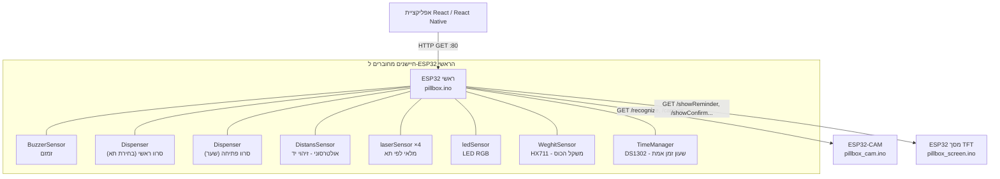

# 💊 PILL Box — קופסת תרופות חכמה מבוססת ESP32

מערכת IoT מבוססת שלושה בקרי **ESP32** (ראשי, מצלמה, מסך) לניהול אוטומטי של נטילת תרופות: הוצאה מתוזמנת של כדורים לפי לוח זמנים, זיהוי פנים לפני שחרור, בקרת מלאי בעזרת חיישני לייזר, אימות נטילה בעזרת חיישן משקל ומרחק, והתראות קוליות/חזותיות. המערכת חושפת REST API מלא שאיתו מדברת אפליקציית לקוח (React / React Native).

> 📌 הפרויקט נבנה כאוסף של **ספריות Arduino עצמאיות** (חיישן אחד = ספרייה אחת) + שלושה סקצ'ים ראשיים, כך שכל רכיב חומרה ניתן לבדיקה ולפיתוח בנפרד לפני החיבור למערכת המלאה.

---

## 📖 תוכן עניינים

- [סקירה כללית](#-סקירה-כללית)
- [ארכיטקטורת המערכת](#-ארכיטקטורת-המערכת)
- [מבנה הפרויקט](#-מבנה-הפרויקט)
- [רשימת חומרה (BOM)](#-רשימת-חומרה-bom)
- [מיפוי פינים](#-מיפוי-פינים)
- [התקנה והרצה](#-התקנה-והרצה)
- [הגדרת רשת WiFi וכתובות IP](#-הגדרת-רשת-wifi-וכתובות-ip)
- [תיעוד ה-API](#-תיעוד-ה-api)
- [לוגיקת המערכת](#-לוגיקת-המערכת)
- [התאמה אישית — לוח הזמנים](#-התאמה-אישית--לוח-הזמנים)
- [בעיות ידועות / TODO](#-בעיות-ידועות--todo)
- [אבטחה והערות חשובות](#-אבטחה-והערות-חשובות)
- [רישיון](#-רישיון)

---

## 🧭 סקירה כללית

הפרויקט מורכב משלושה בקרי ESP32 שמתקשרים ביניהם ברשת מקומית באמצעות בקשות `HTTP GET` פשוטות:

| בקר | קובץ הסקצ' | תפקיד |
|---|---|---|
| **ESP32 ראשי** | `pillbox/pillbox.ino` | מנהל את כל החיישנים, הלוגיקה, לוח הזמנים, ומריץ שרת HTTP שהאפליקציה מדברת איתו |
| **ESP32-CAM** | `pillbox_cam/pillbox_cam.ino` | מצלמה שמסתכלת על כוס הכדורים — משדרת וידאו חי (MJPEG), מצלמת תמונת תיעוד ומבצעת snapshot |
| **ESP32 + מסך TFT** | `pillbox_screen/pillbox_screen.ino` | מציג ממשק גרפי למשתמש (תזכורות, אישורים, מצב מלאי) |

הבקר הראשי הוא "המוח" של המערכת: הוא שולט על שני מנועי סרוו (בחירת תא + פתיחת שער), מקלט/י לייזר לזיהוי מלאי בכל תא, חיישן מרחק אולטרסוני לזיהוי יד מעל הכוס, תא משקל (HX711) לאימות שהכדור נלקח, שעון זמן אמת (RTC DS1302), זמזם ו-LED RGB להתראות — ומתאם בין כולם דרך קריאות HTTP למצלמה ולמסך.

---

## 🏗️ ארכיטקטורת המערכת



**זרימת עבודה טיפוסית (מינון מתוזמן):**

1. ה-RTC על הבקר הראשי מזהה שהגיעה שעת מינון וקיים כדור בתא הרלוונטי.
2. הבקר הראשי מבקש מהמסך להציג "תזכורת" ומהמצלמה לאמת זיהוי פנים (`checkAuth`, מדגם כל 2 שניות, עד 10 דקות).
3. לאחר זיהוי מוצלח — הסרוו הראשי מסובב לתא הנכון, הסרוו השני פותח את השער, ה-LED וה-Buzzer מתריעים, המסך עובר למסך תזכורת, והמצלמה מצלמת לתיעוד.
4. חיישן המרחק מזהה כניסה/יציאה של יד מעל הכוס ומסמן אישור נטילה (`checkMedicineTaken`), עם Timeout של 10 דקות אם לא נלקח.
5. אם עברו 10 דקות ולא הייתה נטילה — התראת "מנה הוחמצה".

---

## 📁 מבנה הפרויקט

```
pill--box--Arduino/
├── pillbox/                 # ⭐ הסקצ' הראשי - כל הלוגיקה והשרת HTTP
│   └── pillbox.ino
├── pillbox_cam/              # ⭐ סקצ' ל-ESP32-CAM (AI Thinker)
│   └── pillbox_cam.ino
├── pillbox_screen/           # ⭐ סקצ' ל-ESP32 עם מסך TFT
│   └── pillbox_screen.ino
│
├── BuzzerSensor/              # ספריית זמזם (PWM דרך LEDC)
├── Dispenser/                 # ספריית סרוו ידני (ללא Servo.h, PWM דרך LEDC)
├── distansSensor/              # ספריית חיישן מרחק אולטרסוני (זיהוי יד)
├── laserSensor/                # ספריית חיישני לייזר (מלאי 4 תאים)
├── ledSensor/                  # ספריית LED RGB + התראות
├── WeghitSensor/                # ספריית משקל HX711 (bit-bang ידני)
├── TimeManager/                 # ספריית RTC DS1302 (בקרת פרוטוקול ידנית)
├── tftSensor/                   # ספריית גרפיקה למסך ILI9341/ST7789 (SPI תוכנתי)
└── SmartCam/SmartCam/            # ספריית מצלמה חלופית (מחלקה SmartCam לזרימת סטרימינג)
```

כל תיקיית חיישן בנויה כ**ספריית Arduino עצמאית**: קובץ `.h` (הצהרות), `.cpp` (מימוש), `.ino` (סקצ' דוגמה/בדיקה עצמאי לחיישן), וקובץ `KEYWORD.txt` להדגשת תחביר ב-Arduino IDE.

---

## 🧰 רשימת חומרה (BOM)

| רכיב | כמות | הערות |
|---|---|---|
| ESP32 DevKit (בקר ראשי) | 1 | מריץ את `pillbox.ino` |
| ESP32-CAM (AI Thinker) | 1 | מריץ את `pillbox_cam.ino` |
| ESP32 DevKit + מסך TFT ‏2.8" (ILI9341/ST7789) + מגע XPT2046 | 1 | מריץ את `pillbox_screen.ino` |
| מנוע סרוו | 2 | אחד לבחירת תא, אחד לפתיחת שער |
| חיישן מרחק אולטרסוני (HC-SR04) | 1 | זיהוי יד מעל הכוס |
| מקלט לייזר (או מודול לייזר משדר/מקלט) | 4 | זיהוי מלאי — תא לכל אחד |
| LED RGB (משותף אנודה/קתודה) | 1 | התראות חזותיות |
| זמזם (Buzzer פסיבי) | 1 | התראות קוליות |
| תא עומס + מגבר HX711 | 1 | מדידת משקל הכוס |
| שעון זמן אמת DS1302 + סוללת גיבוי | 1 | שמירת שעה גם ללא WiFi |

---

## 🔌 מיפוי פינים

### ESP32 ראשי (`pillbox.ino`)

| רכיב | GPIO | הגדרה בקוד |
|---|---|---|
| זמזם | 4 | `BUZZER_PIN` |
| סרוו ראשי (בחירת תא) | 13 | `MAIN_SERVO_PIN` |
| סרוו פתיחה (שער) | 15 | `OPEN_SERVO_PIN` |
| חיישן מרחק — Trigger | 5 | `DIST_TRIG_PIN` |
| חיישן מרחק — Echo | 18 | `DIST_ECHO_PIN` |
| לייזר תא 0 | 34 | `LASER_0_PIN` |
| לייזר תא 1 | 35 | `LASER_1_PIN` |
| לייזר תא 2 | 36 | `LASER_2_PIN` |
| לייזר תא 3 | 39 | `LASER_3_PIN` |
| LED RGB — אדום | 27 | `LED_RED_PIN` |
| LED RGB — ירוק | 14 | `LED_GREEN_PIN` |
| LED RGB — כחול | 12 | `LED_BLUE_PIN` |
| משקל — DOUT | 32 | `WEIGHT_DOUT_PIN` |
| משקל — SCK | 33 | `WEIGHT_SCK_PIN` |
| RTC — CLK | 22 | `RTC_CLK_PIN` |
| RTC — DAT | 21 | `RTC_DAT_PIN` |
| RTC — RST | 19 | `RTC_RST_PIN` |

### ESP32 מסך (`pillbox_screen.ino` / `tftSensor.h`)

| רכיב | GPIO |
|---|---|
| TFT CS | 22 |
| TFT DC | 13 |
| TFT RST | 23 |
| TFT Backlight | 27 |
| Touch CS | 33 |
| Touch IRQ | 34 |
| SPI MOSI (bit-bang) | 12 |
| SPI SCK (bit-bang) | 14 |

### ESP32-CAM (`pillbox_cam.ino`)

פינוע קבוע של לוח **AI Thinker ESP32-CAM** — **אסור לשנות** (מוגדר בקוד עצמו: `PWDN=32, XCLK=0, SIOD=26, SIOC=27, Y2..Y9, VSYNC=25, HREF=23, PCLK=22`, ופלאש מובנה על פין `4`).

---

## ⚙️ התקנה והרצה

### 1. דרישות תוכנה

- [Arduino IDE](https://www.arduino.cc/en/software) ‏(גרסה 1.8.x ומעלה, או Arduino IDE 2)
- הוספת תמיכת לוחות **ESP32** דרך Boards Manager (Espressif Systems)
- ספריית **ArduinoJson** (דרך Library Manager)

> שאר הספריות שהקוד משתמש בהן (`WiFi.h`, `WebServer.h`, `HTTPClient.h`, `SPIFFS.h`, `esp_camera.h` וכו') מגיעות מובנות עם חבילת הלוחות של ESP32 ואינן דורשות התקנה נפרדת.

### 2. התקנת הספריות המותאמות אישית

יש להעתיק כל אחת מהתיקיות הבאות אל תיקיית ה-`libraries` של Arduino (בדרך כלל `Documents/Arduino/libraries`):

```
BuzzerSensor/  Dispenser/  distansSensor/  laserSensor/
ledSensor/  WeghitSensor/  TimeManager/  tftSensor/
```

לאחר ההעתקה — יש להפעיל מחדש את Arduino IDE כדי שהספריות ייטענו.

### 3. העלאת כל בקר בנפרד

| שלב | לבקר | פעולה |
|---|---|---|
| א | ESP32-CAM | פתחו את `pillbox_cam/pillbox_cam.ino`, בחרו Board = "AI Thinker ESP32-CAM", עדכנו SSID/סיסמה, העלו (נדרש להחזיק פין GPIO0 ל-GND בזמן העלאה) |
| ב | ESP32 מסך | פתחו את `pillbox_screen/pillbox_screen.ino`, עדכנו SSID/סיסמה, העלו ללוח ה-ESP32 |
| ג | ESP32 ראשי | פתחו את `pillbox/pillbox.ino`, עדכנו SSID/סיסמה **וגם** את כתובות ה-IP של המצלמה והמסך (ראו סעיף הבא), העלו אחרון |

לאחר כל העלאה, פיתחו את ה-Serial Monitor (‎115200 baud) — כל בקר ידפיס את כתובת ה-IP שקיבל מהראוטר.

---

## 📶 הגדרת רשת WiFi וכתובות IP

⚠️ **בקובצי הקוד יש שדות פרטי WiFi — אך הם ריקים/פיקטיביים בברירת המחדל, ולא נמצא בפועל שם רשת או סיסמה אמיתיים בקבצים שנבדקו.** בכל שלושת הסקצ'ים מופיע:

```cpp
const char* WIFI_SSID     = "YOUR_WIFI_NAME";
const char* WIFI_PASSWORD = "YOUR_WIFI_PASS";
```

כלומר **אין צורך למחוק דבר לפני העלאה ל-GitHub** — אלו כבר ערכי Placeholder גנריים. יש רק לזכור:

1. למלא ערכים אמיתיים באופן מקומי לפני העלאה לבקר (ולא לשמור אותם ב-git אם מדובר ברשת פרטית — כדאי לשקול קובץ `secrets.h` שנמצא ב-`.gitignore`, ראו סעיף "בעיות ידועות").
2. לאחר העלאת `pillbox_cam.ino` ו-`pillbox_screen.ino`, לרשום את כתובות ה-IP שהם מקבלים ולעדכן ב-`pillbox/pillbox.ino`:

```cpp
const char* CAM_IP    = "192.168.1.101"; // עדכני לפי מה שמודפס ב-Serial Monitor של ESP32-CAM
const char* SCREEN_IP = "192.168.1.102"; // עדכני לפי מה שמודפס ב-Serial Monitor של ESP32 המסך
```

> 💡 מומלץ להקצות **IP קבוע (Static/DHCP Reservation)** לכל אחד משלושת הבקרים בראוטר הביתי, כדי שהכתובות לא ישתנו בין הפעלות.

---

## 🌐 תיעוד ה-API

כל שלושת הבקרים מריצים שרת HTTP על פורט `80`, עם תמיכת CORS (`Access-Control-Allow-Origin: *`) כדי לאפשר קריאה ישירה מאפליקציית ווב/מובייל.

### ESP32 ראשי — `pillbox.ino`

| Method | נתיב | פרמטרים | תיאור | תגובה |
|---|---|---|---|---|
| GET | `/status` | — | מצב מלא של המערכת: שעה, האם ממתינים לנטילה, תרופה אחרונה, שעת המנה הבאה, משקל הכוס, סטטוס משכך כאבים, מצב 4 התאים | JSON |
| GET | `/dispense` | `cell` (0-3) | הוצאת תרופה ידנית מהאפליקציה (ללא זיהוי פנים) | JSON |
| GET | `/painkiller` | — | בקשת משכך כאבים — בודק שעברו 6 שעות (`PAIN_KILLER_WAIT_MIN`) מהמנה הקודמת, ואז מפעיל זיהוי פנים | JSON |
| GET | `/inventory` | — | מצב מלאי מפורט לכל 4 התאים (שם תרופה, שעה מתוזמנת, האם מלא) | JSON |
| GET | `/setschedule` | `cell`, `hour`, `minute` | עדכון שעת מינון עבור תא מסוים | JSON |

דוגמת תגובה מ-`/status`:

```json
{
  "time": "14:32:10",
  "waitingForTake": false,
  "lastMedicine": "Vitamin D",
  "medicineConfirmed": true,
  "nextDoseHour": 20,
  "nextDoseMinute": 0,
  "cupWeight": 0.4,
  "painKillerAllowed": true,
  "cells": [true, true, false, true]
}
```

### ESP32-CAM — `pillbox_cam.ino`

| Method | נתיב | תיאור |
|---|---|---|
| GET | `/stream` | סטרימינג וידאו חי בפורמט MJPEG (מתאים לתג ``) |
| GET | `/capture` | צילום תמונה, שמירה ב-SPIFFS בשם `dose_<millis>.jpg`, והחזרת ה-JPEG בתגובה |
| GET | `/snapshot` | תמונה בודדת עבור תצוגה באפליקציה |

### ESP32 מסך — `pillbox_screen.ino`

| Method | נתיב | פרמטרים | תיאור |
|---|---|---|---|
| GET | `/showHome` | `time` | מסך בית עם השעה הנוכחית |
| GET | `/showReminder` | `med`, `dose` | מסך תזכורת נטילה |
| GET | `/showConfirm` | `ok` (0/1) | מסך אישור (ירוק) או החמצה (אדום) |
| GET | `/showInventory` | `c0`,`c1`,`c2`,`c3` (0/1) | מסך מצב מלאי 4 תאים |
| GET | `/showError` | `msg` | מסך שגיאה חופשי |

---

## 🧠 לוגיקת המערכת

- **לוח זמנים** — מוגדר כמערך `ScheduledDose` בראש `pillbox.ino`, ונבדק כל דקה (`checkSchedule`).
- **זיהוי פנים לפני שחרור** — כל מינון (מתוזמן או משכך כאבים) עובר קודם דרך `verifyUserFace()`, שקוראת ל-`GET /recognize` במצלמה ומצפה לתגובת JSON מהצורה `{"status":"success","user":"Shira"}`.
- **הגנת משכך כאבים (PRN)** — טיימר נפרד ב-`TimeManager` (`isSafetyIntervalPassed` / `recordDispenseTime`) חוסם בקשות משכך כאבים למשך 6 שעות (`PAIN_KILLER_WAIT_MIN = 360` דקות) מהמנה הקודמת.
- **אישור נטילה** — נבדק על ידי `DistansSensor`: כניסת יד ואז יציאתה מעל הכוס (debounce מובנה), עם Timeout של 10 דקות (`DOSE_CONFIRM_TIMEOUT`).
- **מלאי** — 4 חיישני לייזר קוראים אם יש כדורים בכל תא; כש-2 תאים או פחות (`LOW_STOCK_THRESHOLD`) נשארים מלאים, נשלחת התראת מלאי נמוך.

---

## 🛠️ התאמה אישית — לוח הזמנים

ניתן לערוך ישירות בקוד (`pillbox.ino`), או דרך ה-API (`/setschedule`):

```cpp
ScheduledDose schedule[] = {
  { 8,  0, 0, "Aspirin" },
  { 14, 0, 1, "Vitamin D" },
  { 20, 0, 2, "Omega 3" },
  { 22, 30, 3, "Melatonin" },
};
```

כל שורה: `{שעה, דקות, מספר תא (0-3), שם תרופה}`.

---

## 🐞 בעיות ידועות / TODO

- ⚠️ **קובץ `AlertType.h` חסר בריפו** — `BuzzerSensor.h` ו-`ledSensor.h` כוללים `#include <AlertType.h>` ומשתמשים בקבועים כמו `ALERT_MEDICATION_TIME`, `ALERT_PAIN_REQUEST`, `ALERT_STOCK_LOW`, `ALERT_MISSED_DOSE` — אך הספרייה שמגדירה אותם (כנראה `AlertSystem`, לפי קובץ ה-KEYWORD) לא נמצאת בזיפ. **יש להוסיף אותה כדי שהקוד יתקמפל.**
- ⚠️ **נתיב `/recognize` לא ממומש בפועל** — `pillbox.ino` קורא ל-`http://<CAM_IP>/recognize`, אך ב-`pillbox_cam.ino` הנוכחי מוגדרים רק `/stream`, `/capture`, `/snapshot`. ייתכן שזה תפקידה של ספריית `SmartCam` (שנמצאת בתיקייה נפרדת ולא מחוברת עדיין לסקצ' של המצלמה) — יש להשלים חיבור בין השניים.
- 🔧 **כתובות IP קבועות בקוד (`CAM_IP`, `SCREEN_IP`)** — דורש עדכון ידני בכל פעם שהראוטר מקצה IP חדש. מומלץ לשקול mDNS (‎`.local`) או IP סטטי בראוטר.
- 🔧 **פרטי WiFi בקוד המקור** — כרגע Placeholder בלבד, אבל אם יתמלאו ערכים אמיתיים לפני commit, מומלץ להעביר אותם לקובץ `secrets.h` נפרד שנמצא ב-`.gitignore` (ראו הצעה בסעיף הבא).
- 🔧 שדה `pendingCellID` הוגדר אך `pendingScheduleIndex`/הגדרות SmartCam לא תמיד מסונכרנות בין הקבצים — כדאי סבב בדיקות אינטגרציה מלא בין שלושת הבקרים.

---

## 🔒 אבטחה והערות חשובות

- ה-API כרגע **פתוח לחלוטין וללא אימות** (כל מכשיר ברשת המקומית יכול לקרוא ל-`/dispense`) — מתאים לשימוש ביתי מאחורי ראוטר פרטי, אך **לא מומלץ לחשוף את הבקרים לאינטרנט** ללא הוספת שכבת הרשאה.
- מומלץ להוסיף קובץ `secrets.h` (עם `WIFI_SSID`/`WIFI_PASSWORD` אמיתיים) ולהוסיפו ל-`.gitignore`, כך שפרטי הרשת האמיתיים לעולם לא יגיעו ל-GitHub — גם אם בעתיד ימולאו ישירות בקוד לצורך בדיקה מקומית.

---

## 📄 רישיון

לא הוגדר רישיון עדיין. מומלץ להוסיף קובץ `LICENSE` (למשל MIT) אם הפרויקט מיועד להיות פתוח לציבור.
